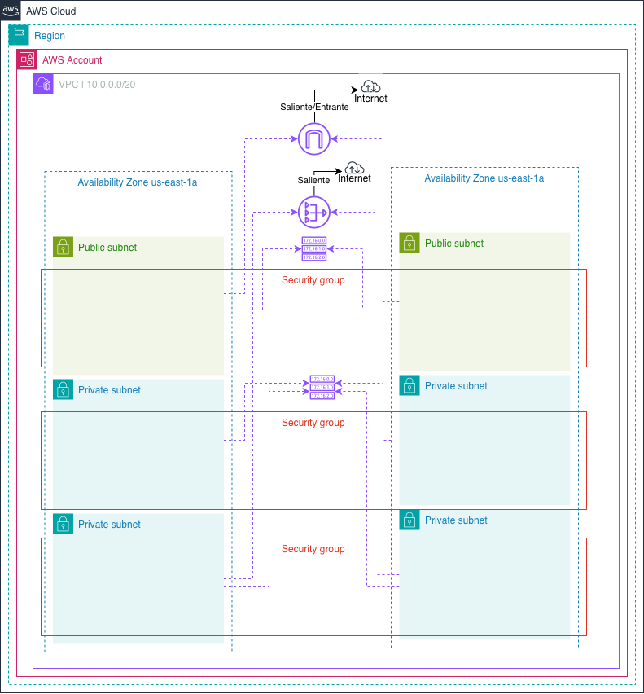

# Construyendo nuestra VPC Base en AWS con Terraform

¡Hola! Bienvenido/a a la documentación de este módulo. Aquí vamos a explorar cómo estamos utilizando Terraform para crear una infraestructura de red sólida y estructurada (una VPC) en AWS.

Piensa en este módulo como los "cimientos" de un edificio: antes de levantar las paredes (nuestros servidores) necesitamos preparar el terreno, dividir los espacios y armar los caminos para que todos puedan comunicarse.


_(El diagrama anterior ilustra exactamente lo que nuestro código Terraform está creando en AWS)_

---

## ¿Qué recursos estamos construyendo?

Si observas el diagrama y lo comparas con nuestro archivo `main.tf`, notarás que estamos aprovisionando:

- **1 VPC (Virtual Private Cloud):** Nuestro entorno lógico de red privado y aislado donde vivirán todos los recursos.
- **1 Internet Gateway:** La puerta principal por donde entrará y saldrá el tráfico público de internet hacia nuestras subredes expuestas.
- **1 NAT Gateway y su IP Elástica:** El "traductor" inteligente. Le permite a nuestras máquinas en subredes privadas navegar en internet (para descargar parches, actualizaciones, etc.) de forma unidireccional y segura, sin recibir conexiones desde el exterior. _(Nota: ¡en este escenario usamos 1 solo recurso NAT compartido para ahorrar costos en nuestro laboratorio!)_.
- **6 Subredes (Subnets) distribuidas en 2 Zonas de Disponibilidad:** Repartir nuestra red a través de distintas zonas asegura que, si una falla, otra pueda tomar la carga (Alta Disponibilidad).

---

## El arte de dividir nuestra red: Función `cidrsubnet`

Uno de los desafíos en redes es asignar direcciones IP manualmente, lo cual suele ser algo tedioso y propenso al error humano o "capa 8". En nuestro código, esto está resuelto automatizando el cálculo mediante la función interna de Terraform: `cidrsubnet()`.

La fórmula que usamos funciona como cortar un gran pastel matemático en rebanadas más pequeñas:
`cidrsubnet(prefix, newbits, netnum)`

- **`prefix`**: Tu bloque de red original o "pastel completo" (por ejemplo: `10.0.0.0/20`).
- **`newbits`**: Cuántos bits adicionales quieres sumar a tu máscara de red para hacerla más estricta. Aquí implementamos la variable **`var.subnet_newbits`** para darte total flexibilidad desde afuera:
  - Si nuestra VPC base es de tamaño `/20` y le pasamos `subnet_newbits = 8`: `20 + 8 = 28`. Tus subredes serán tamaño `/28` (entregando **11 IPs utilizables** cada una).
  - Si le pasamos `subnet_newbits = 4`: `20 + 4 = 24`. Tus subredes quedarán de tamaño `/24` (abriendo paso a **251 IPs utilizables** cada una).
    _(¡Pruébalo fácilmente configurando `subnet_newbits = 4` en tu archivo `local.tfvars`!)_
- **`netnum`**: El "número de porción" o índice numérico (0, 1, 2, 3...) de la subred para asegurarse de que seleccionamos una porción de red diferente cada vez sin sobreponernos.

---

### Evitando colisiones de red (El problema del Overlap)

Nuestro esquema red se divide en 3 capas ("tiers"): la capa web (pública), la capa de aplicación (privada) y la capa de datos (base de datos privada). Estas se iteran automáticamente basándose en el número de Zonas de Disponibilidad ($N = 2$).

Si generáramos las subredes sin pensar en nuestro cálculo matemático, Terraform crearía las públicas en los índices `0, 1` y luego cometería el error de intentar mapear las privadas **nuevamente en los índices `0, 1`**. Esto arrojaría un fatal error diciendo que ambas subredes chocan ocupando un mismo rango IP.

**¿Cómo es que nuestro `main.tf` soluciona esto como magia?** Usamos **saltos numéricos lógicos** (u offsets):

1. **Subredes Públicas (Web Tier):** Iteran de manera normal, adjudicándose los índices lógicos **`0 y 1`**.
2. **Subredes Privadas (App Tier):** Tomamos su índice original y le sumamos un _offset_ basado en el total de zonas, que es `2`. De modo que iteran las porciones **`2 y 3`** (`[0] + 2` y `[1] + 2`). ¡Cero colisión!
3. **Subredes de BD (Database Tier):** Las pasamos aún más lejos. Requerimos un offset doble para evitar empujar la colisión abajo (`total de zonas * 2 = 4`). Ellas consumirán maravillosamente las porciones **`4 y 5`** de nuestro gran pastel VPC.

---

**En conclusión:** Inyectar esta lógica de programación en IaC (Infraestructura como código) nos asegura una robustez impresionante. El día de mañana, si AWS lanza una tercera zona en nuestra región y cambiamos ese parámetro local, el motor matemático de las subredes recalculará todos los prefijos sin que toques una sola línea de lógica en el código base.

---

## Guía Rápida: Comandos Terraform

Para probar y desplegar este proyecto, asegúrate de estar dentro de la carpeta del proyecto y tener tus credenciales de CLI de AWS configuradas. Todos los comandos clave consumen el archivo de variables `local.tfvars`:

1. **Inicializar Terraform** (prepara tu entorno y descarga los plugins de AWS):

   ```bash
   terraform init
   ```

2. **Validar la configuración** (revisa que tu código no contenga errores gramaticales o de referencia):

   ```bash
   terraform validate
   ```

3. **Planificar los cambios** (genera una simulación de lo que sucederá en AWS y lo guarda en `tfplan`):

   ```bash
   terraform plan --out tfplan --var-file local.tfvars
   ```

4. **Aplicar los cambios** (ejecuta literalmente el plan y construye los recursos):

   ```bash
   terraform apply "tfplan"
   ```

5. **Destruir la infraestructura** (cuando termines de jugar y aprender, limpiar todo previene cobros inesperados en tarjeta):
   ```bash
   terraform destroy --var-file local.tfvars -auto-approve
   ```
